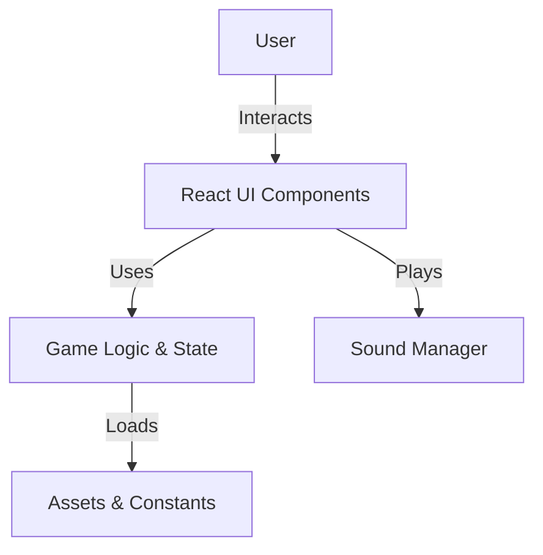

# ARCHITECTURE.md

## 1. Purpose & Scope
This project is a gamified educational web application, focused on skills like reading, math, writing, cleaning, memory, and patterns. This document summarizes the overall architecture, main components, and technology choices.

## 2. System Overview
The system is a React-based single-page application (SPA) with a game-like interface. Users interact with various skill-based challenges, collect achievements, and progress through levels. The app features dynamic UI components, sound management, and persistent state.

## 3. Key Requirements & Constraints
- Engaging, game-like user experience for educational content
- Modular, maintainable React component structure
- Responsive UI with animations and sound
- Support for achievements, skills, and parental controls
- Runs in modern browsers; deployable via Docker

## 4. High-Level Architecture Diagram

## 5. Main Components & Responsibilities
| Component         | Responsibility                                      |
|-------------------|-----------------------------------------------------|
| App.jsx           | Main app logic, state management, routing           |
| components/       | UI elements (drawers, modals, skill cards, etc.)    |
| utils/            | Game logic, sound management, achievement logic     |
| constants/        | Static data: assets, game data, achievements        |
| public/assets/    | Images, sounds, and other static resources          |

## 6. Data Flow / Key Interactions
- User actions in the UI trigger state changes in App.jsx.
- Game logic in utils/ updates skill levels, achievements, and triggers sounds.
- UI components display current state and feedback (e.g., toasts, modals).
- Assets and constants provide data for rendering and logic.

## 7. Technologies & Tools Used
- React (SPA framework)
- Vite (build tool)
- Tailwind CSS (styling)
- Lucide-react (icons)
- Docker (deployment)
- Mermaid (for diagrams, optional)

## 8. Deployment Overview
- Built with Vite and bundled for production.
- Can be containerized and deployed using Docker.
- Static assets served from public/ directory.

## 9. Quality Attributes
- Scalability: Modular React components, easy to extend.
- Security: Parental controls, safe asset handling.
- Maintainability: Clear separation of concerns, reusable utilities.
- Performance: Optimized asset loading, sound management.

## 10. Glossary (Optional)
- SPA: Single Page Application
- BGM: Background Music
- UI: User Interface
